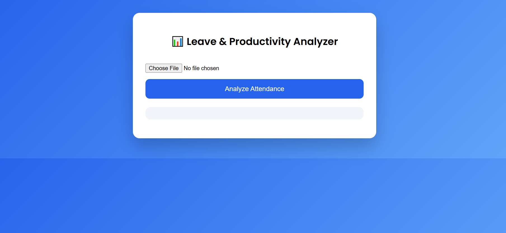
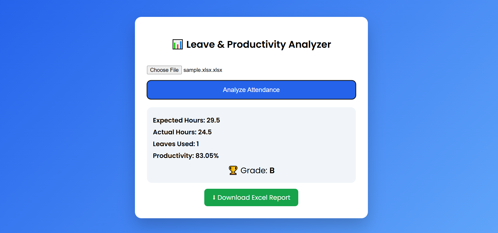

Frontend: Simple HTML/CSS/JS interface for file upload and result display  
Backend: FastAPI + Pandas for attendance analysis and productivity calculation

# 📊 Leave & Productivity Analyzer

A web-based application to analyze employee attendance and productivity using Excel files.


##  Features
- Upload Excel attendance file
- Monthly productivity summary
- Productivity grade (A / B / C)
- Clean & attractive UI
- Excel-based analysis


##  File Upload Screen



##  Output Screen



## Tech Stack
- Python (FastAPI)
- Pandas
- HTML, CSS
- JavaScript

---

##  How to Run

```bash
cd backend
pip install -r requirements.txt
uvicorn app:app --reload

## Live Demo
 https://relaxed-gumption-83969b.netlify.app

## Note
Backend (FastAPI) runs locally.
Frontend is deployed on Netlify for demo purposes.


