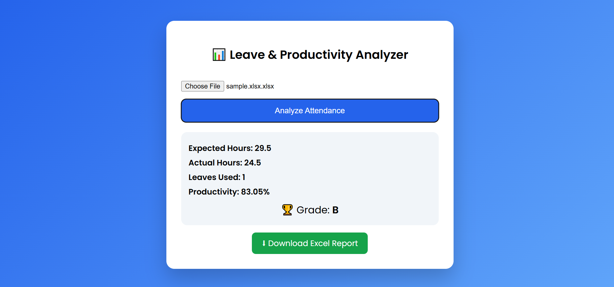

# 📊 Leave & Productivity Analyzer


A **web-based application** that analyzes employee attendance data from **Excel files** to calculate leaves, working days, and generate **monthly productivity summaries with grading**.

---

## 🚀 Features

- Upload Excel-based attendance files  
- Automatic leave & working day calculation  
- Monthly productivity analysis  
- Productivity grading (A / B / C)  
- Fast and reliable data processing using Pandas  
- Simple and user-friendly web interface  

---

## 🧠 Workflow

1. User uploads an Excel attendance file  
2. File is sent to the FastAPI backend  
3. Pandas processes attendance and leave data  
4. Productivity metrics and grades are calculated  
5. Results are displayed on the web interface  

---

## 🛠️ Tech Stack

### Frontend
- HTML  
- CSS  
- JavaScript  

### Backend
- Python  
- FastAPI  
- Pandas  

---

## 📸 Screenshots

| File Upload | Results |
|------------|---------|
|  |  |

---

## ⚙️ Installation & Run

### Backend
```bash
cd backend
pip install -r requirements.txt
uvicorn app:app --reload

---


Frontend

Open index.html in a browser
OR

Deploy using Netlify or any static hosting service

## Live Demo

🔗 Frontend: https://relaxed-gumption-83969b.netlify.app

## Note: Backend (FastAPI) runs locally

## Output

Accurate attendance and leave calculation

Automated productivity grading

Clean and structured result visualization

📁 Project Structure
leave-productivity-analyzer/
│
├── backend/
│   ├── app.py
│   └── requirements.txt
│
├── frontend/
│   ├── index.html
│   ├── style.css
│   └── script.js
│
├── screens/
│   ├── upload.png
│   └── output.png
│
└── README.md

### Author

Radhika Vyas

